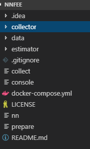
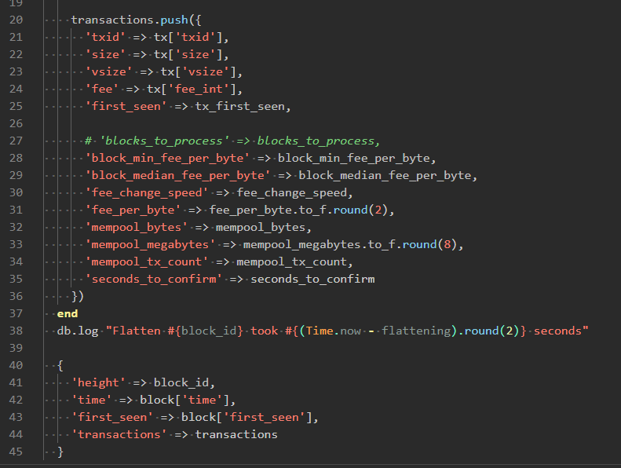
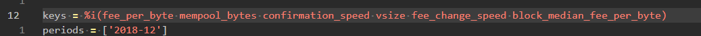
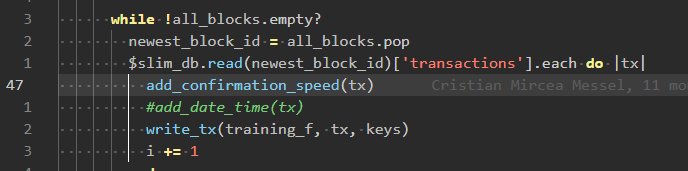
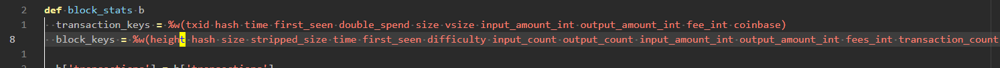

# Collector
The periods to get data for are customized in the code, please below if you need complete example follow the code in the [commit](https://gitlab.inyar.ru/bitcoin-transaction-optimization/nnfe/commit/dfac9b05c3d40fe41a38756d85ea0c213581b33b).


It a ruby based application which running in Docker container.
So prerequisite is to install `Docker` for your system. There is some code here which allows to train the model but for purpose of BTO we only using code in `collector` folder.



1. Getting the data to analyze
    1. First of all we need to download the metadata for part of blockchain this done by executing (this line can also be copied from `collect` file in the root).
		```
		docker-compose run collector ruby collect.rb
		```
		Followed by updating `$last_block_index` variable(if needed) in `collector/harmony.rb` to the latest

   1. Give script some time to work (approx 100-200 mb in `/data/collector/data` should be enough to start) it will also load the  `/data/collector/mempool.log` (which is what got from [here](https://jochen-hoenicke.de/queue/mempool.log)) with mempool characteristics logged each minute.

   2. After that just stop the execution (unless you want the whole blockchain which is more than 200Gb in that form of metadata blocks) by hitting `Ctrl-C` in console window
2. Next we need combine information from blockchain and mempool statistics.
	1. This is done by executing prepare script with command (copy exactly with quotes, the line of code also live in `prepare` file in the root)
		```
		docker-compose run collector ruby prepare.rb "$@"
		```
		Followed by updating the periods you need to analyze (on the top of `/collector/prepare.rb`)
It will create json representation of mempool log and also read the blockchain metadata, then all data processed, saved some intermediate output to slim db (files in `/data/collector/slim`) and final result to `/data/collector/out/*training.csv`

## Questions\answers
1. **Which data saved to slim db?**
    * The one which is returned in hashes from `/collector/src/utils.rb::raw_read_with_mempool()`
    
	* **If you need to update the transactions info saved** then you need also remove the `/data/collector/slim/*` files, otherwise no new info appear.

2. **How can I choose which features to include into output csv?**
   * Just update the list of keys in `/collector/prepare.rb` this will add the columns to output file in order specified
    

		Possible options for keys are info in transactions which is combination of data we pushed to slim db and some which added in `collector/prepare.rb` loop like `add_confirmation_speed` defined in `/collector/src/utils.rb`

	

3. **What we have in metadata for blocks and transaction which might not be pushed to slim db?**
   * Check out the `/collector/src/utils.rb::block_stats()` for more info
    

4. **My output is blank for period, why?**
   * It likely because there is no related mempool info in the `mempool.json`
     1. Make sure that specified period of time is described in mempool.log. You might be need to download the recent version from the site (or just remove the file and allow script do its work).
     2. Check mempool start time in `docker-compose.yml` it should start before the time period you want to collect.
     3. Remove the `mempool.json` file among with `/data/collector/slim/*` files and start prepare script one more time.