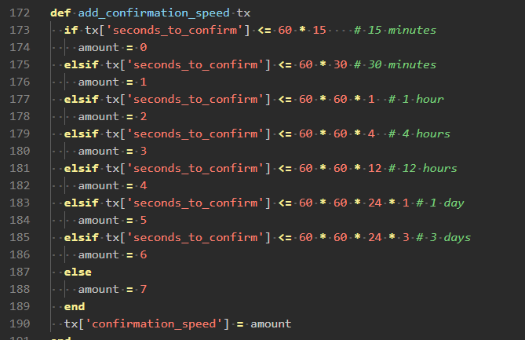
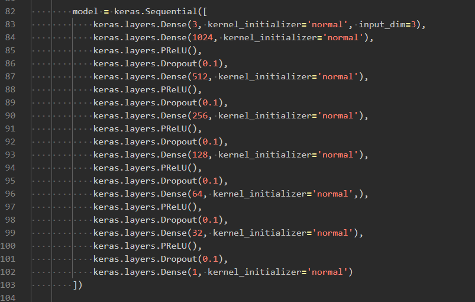

# Fee predictor trainer
This is python based app which is fully developed in Akvelon. Its purpose is to train the model and save it for further usage based on the data we got from Collector app (the `*training.csv` file). Just place it following `Readme.md` in [repo root](https://gitlab.inyar.ru/bitcoin-transaction-optimization/predictor-trainer) and run the app. The model built can be used further by fee predictor API

## Data
The most important part as it both define what model to use and how well it can be trained so eventually data is the thing which mostly defines the result of our prediction. Our data represents the transactions characteristics and some mempool statistics for the transaction

At this moment we using following data

1. `fee_per_byte` - our target or **Y** vector, as result of training we want to get the model able to predict the fee per byte we need to set so that our transaction defined with other characteristics and with current state of mempool were added to blockchain in specifed time. We assume that fee per byte is the main factor which defined when our transaction would be added to blockchain, if it greater than our transaction would be added faster. If it small (less than **1-2 satoshi/byte**) then probably it would be never included to block.

2. `mempool_bytes` - we have block size limited to **1Mb** and mean speed for addition of new block equal to 10min, which means that if our assumption on fee_per_byte valid then it need to be increased when mempool bigger in order to provide the same confirmation speed. It in bytes so that use the same measurement units as `fee_per_byte`

3. `confirmation_speed` - at this moment this is digital characteristic how fast is our transaction was added to mempool

	

	We need update it further to have count of blocks it took from time when transaction was added to mempool to the time when transaction was added to the blockchain

5. `fee_change_speed` - this is total fee in pool derivative at the time transaction was confirmed.

	We assume that when values are higher (those some enormous situation when fee raises for reason not related to mempool) we need to raise our `fee_per_byte` as well.

	Actually our total fee is constant at each moment and just raises when new transactions added and decreases when block mined, so real derivative when exists is equal to **0**. We instead approximate the total fee function with linear functions on mempool characteristics and calculate derivative here, omitting the transactions where this derivative negative (which not really happens because total fee decreases immediately and fee just doesn't exists at this point of time). This is small (about 5%) training data loss so we can sacrifice it in favor of robust data.

6. `block_median_fee_per_byte` - our model is based on assumption that similar transaction need to have the similar fee_per_byte to be included. By the way in data we have transaction with enormous `fee_per_byte` (4-200 times higher than normal one), probably this is because people were put down satoshi count for the whole transaction in the fee_per_byte field. Our aim is to make realistic prediction (even better if it smaller than average and still included) so we want to get rid of the noise by removing such transactions. So we calculate the median fee per byte for transactions in block and remove those transactions from the training data where fee_per_byte is greater than median one. Except this filtering, the column not used so it doesn't appear in training data.

## Model
This is another part which need to be set up correctly so that create valid prediction when learned from our test data.

We using high level `keras` api from tensorflow to create the DNN (deep neural network).
It contains of the following fully connected layers

1. Where the first layer have 3 neurons which is equal to 3 features in our training set. It have linear activation function so that just spread the data to neurons in hidden layer.

2. Then there are set of hidden layers where each next level have smaller amount of neurons. The exact number of layers and neurons is just a guess. In theory when having a lot of layers with a lot of neurons it could even design new features from existing ones. The activation function is parametric rectified linear unit(their looks like separate layer in code) which is claimed as best choice to start from if used for hidden layers. And finally after each activation the dropout applied so it reduce overall compensation and our model have better generalisation ability.

3. Finally our output layer contains just single neuron with linear activation function because we want the single output value.

For loss function we tested the `MSE` and `Huber`, when `Huber` provides much smaller absolute values and seems to fit the data better. Both `Adam` and `Rmsprop` optimizers work similar way and rmsprop gives us slightly smaller values so if the whole result correct it better to be used in our problem.

Number of `epochs` can vary, by the way there is no significant change after some of them, so **10** seems to be the good choice.

## Validation

Well to be honest our aim is not to be precise, but predict the lowest value possible, so despite the fact it not really good in terms of accuracy it currently provides us with pretty robust prediction.

So how we can evaluate? The current approach is split all the data onto training set and test set (80/20). Test set is not using during the training.

Once we done with model, we looking in our test data the transactions which are confirmed with `0 time class` and group them by blocks, calculate the min fee, calculated the median fee, do prediction and calculate mean and median predicted fee. Then all values are placed in the same chart and we want the prediction to be somewhat between median and minimum fee, which means (above min fee) that our transaction were confirmed as well and (lower than median fee) we didn't overpay much. 

The close to min fee and following it shape is the best option.

Actually our model targeting now not the low fee but the real fee, so our model **can't** predict the low fee (and predicted shape is more close to median fee per block). As step toward we need consider some way min fee for block as target function.